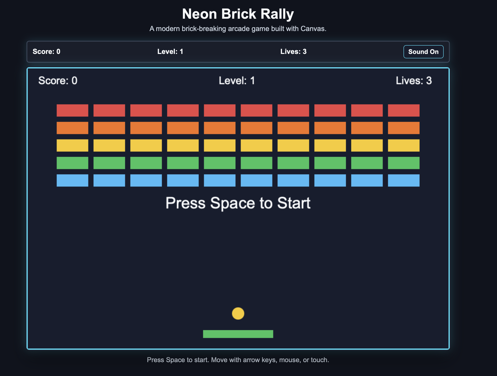

# Neon Brick Rally

Neon Brick Rally is a Breakout-inspired arcade game made for learning HTML, CSS, JavaScript, and the Canvas API. The player controls a paddle, bounces a ball into colorful bricks, collects powerups, and advances through generated levels.

## Features

- Responsive `960 x 640` Canvas game area that scales down on smaller screens
- Keyboard, mouse, and touch paddle controls
- 50 generated levels using reusable layout patterns
- 10 brick layouts, including full grid, checkerboard, pyramid, diamond, border, columns, stripes, staggered, random gaps, and cross
- Gradual difficulty increase with capped ball speed
- Two-hit bricks on later levels
- Powerups for a wider paddle and extra lives
- Score, lives, and level displays
- Start screen, level countdown, game over screen, and final win screen
- Simple Web Audio sound effects with a mute toggle
- No external libraries

## Files Used

- `index.html` - page structure, game title, scoreboard, mute button, canvas, and script/style links
- `style.css` - layout, responsive canvas sizing, arcade colors, and UI styling
- `script.js` - game setup, drawing, controls, collision detection, levels, powerups, sound, and game loop
- `screenshots/neon-brick-rally-preview.svg` - lightweight project preview image for GitHub

## How To Run The Game

Open `index.html` directly in a web browser.

No build step, package install, or server is required.

## Controls

- Press `Space` to start the game.
- Press `Space` after game over or winning to restart.
- Use the left and right arrow keys to move the paddle.
- Move the mouse over the canvas to control the paddle.
- Drag on the canvas on a touch device to control the paddle.
- Use the `Sound On` / `Sound Off` button to mute or unmute sound effects.

## How The Game Works

The game uses an HTML `<canvas>` element for all gameplay drawing. JavaScript updates the ball, paddle, bricks, powerups, score, lives, and current game state inside a `requestAnimationFrame()` game loop.

Levels are generated from reusable layout patterns instead of being manually hard-coded. The layout pattern rotates every 10 levels, while later levels increase difficulty with faster ball speed, more rows, and more two-hit bricks.

When the ball hits a brick, the brick is damaged or destroyed. Destroyed bricks increase the score and may drop a powerup. Clearing all visible bricks advances to the next level. Clearing level 50 shows the final win screen.

## Possible Future Improvements

- Add a pause button
- Add local high score saving with `localStorage`
- Add more powerup types
- Add particle effects when bricks break
- Add level names or short level intro text
- Replace the preview image with a real gameplay screenshot or GIF
- Add automated tests for level generation helper functions

## Learning Note

This is a Breakout-inspired arcade game built as a beginner-friendly project for practicing HTML, CSS, JavaScript, and Canvas. It uses original code, generated visuals, and browser APIs instead of external libraries or copyrighted assets.
